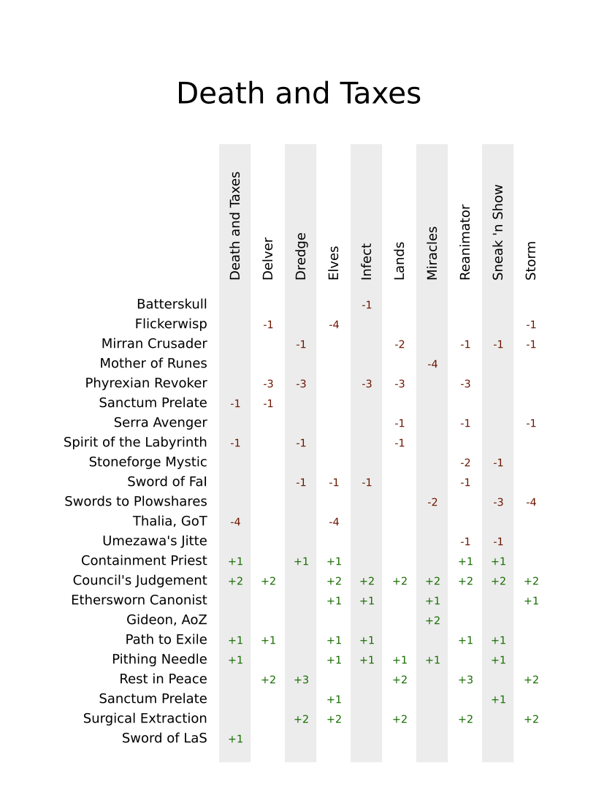

# MtG Sideboard Guide generator

This notebook will guide you how to create concise sideboard guides, printable on a 63 x 88 mm 
standard card. It will load the data from a tab delimited text file, use **pandas** to transform 
the data to a matrix. Next, using a **jinja2** template, these data are turned into an **SVG** image.

